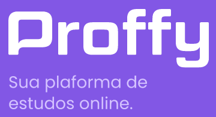

<h1 align="center">
  
</h1>
<h3 align="center">
  Se você quer dar aulas ou encontrar o professor ideal pra aprender, essa é a melhor plataforma que você vai encontrar hoje 📖️
</h3>
<p align="center">(Aplicação desenvolvida durante a Next Level Week #02 da Rocketseat)</p>
<p align="center">  
  <a href="#">
    
  </a>
  
  <a href="#">
    
  </a>
  
  <a href="https://github.com/rodolfoviolla/nlw02-proffy-backend/blob/master/LICENSE.md">
    
  </a>
</p>

<p align="center">
 <a href="#features">Features</a> •
 <a href="#pr%C3%A9-requisitos">Pré-requisitos</a> • 
 <a href="#rodar-o-servidor-localmente">Rodar o servidor localmente</a> • 
 <a href="#tecnologias">Tecnologias</a> • 
  <a href="#autor">Autor</a> • 
 <a href="#licen%C3%A7a">Licença</a>
</p>

---

### Features

#### Usuários

- [X] Rota para criar novo usuário;
- [X] Rota para se autenticar na aplicação;

#### Aulas

- [X] Rota para criar uma aula;
- [X] Rota de listar aulas;
  - [X] Filtrar por matéria, dia da semana e horário;
  
#### Conexões

- [X] Rota para criar uma nova conexão;
- [X] Rota para listar o total de conexões realizadas;

### Pré-requisitos

Você vai precisar ter instalado em sua máquina as seguintes ferramentas:
[Git](https://git-scm.com), [Node.js](https://nodejs.org/en/) e [Yarn](https://classic.yarnpkg.com/pt-BR/)
Além disto é bom ter um editor para trabalhar com o código como [VSCode](https://code.visualstudio.com/)

### Rodar o servidor localmente

```bash
# Clone este repositório
$ git clone <https://github.com/rodolfoviolla/nlw02-proffy-backend>

# Acesse a pasta do projeto no terminal/cmd
$ cd nlw02-proffy-backend

# Instale as dependências
$ yarn

# Execute a aplicação em modo de desenvolvimento
$ yarn dev:server

# O servidor inciará na porta:3333 - acesse <http://localhost:3333>
```
Você pode importar o Workspace do [Insomnia](https://insomnia.rest/) através do botão abaixo:

<a href="https://insomnia.rest/run/?label=Proffy%20API&uri=https%3A%2F%2Fraw.githubusercontent.com%2Frodolfoviolla%2Fnlw02-proffy-backend%2Fmaster%2Finsomnia.json" target="_blank">
  
</a>

### Tecnologias

As seguintes ferramentas foram usadas na construção do projeto:

- [Node.js](https://nodejs.org/en/)
- [TypeScript](https://www.typescriptlang.org/)

### Autor
---

<p>
  <a href="#">
    
    <br />
    <sub><b>Rodolfo Della Violla</b></sub>
  </a>

  <p>
    <a href="https://www.linkedin.com/in/rodolfoviolla/">
      
    </a>
    <a href="https://twitter.com/RodolfoViolla">
      
    </a>
    <a href="mailto:rodolfo.violla@gmail.com">
      
    </a>
  </p>
</p>

## Licença

Este projeto esta sobe a licença [MIT](./LICENSE.md).
